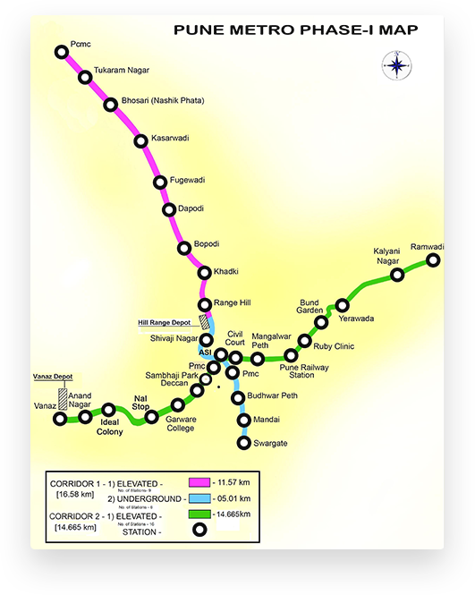

TrackMyMetro-Pune Metro
TrackMyMetro is a software solution designed to assist users in efficiently navigating metro systems in the city of Pune. Rather than being a traditional app or website, this software calculates the minimum distance and best path between two metro stations, providing users with the most efficient route. It estimates the shortest travel time and highlights the correct path to follow, making it a useful tool for planning metro journeys.

TrackMyMetro uses graph theory and Dijkstra's algorithm to calculate the shortest path between two metro stations in Pune. In this system, each metro station is represented as a node (vertex) in a graph, and the paths between stations are edges with weights corresponding to the distance or travel time between them. Dijkstra's algorithm is applied to find the shortest route from a source station to a destination station. The algorithm starts by setting the source station’s distance to 0 and all other stations’ distances to infinity. It then iteratively visits the nearest unvisited station, updating the distances to its neighboring stations. This process continues until the destination station is reached, at which point the shortest path is traced back by following the recorded distances. This approach ensures that the most efficient and optimal route between stations is calculated.

Features:
Route Estimation: Calculates the minimum distance and best route between any two stations.
Real-Time Information: Provides up-to-date details on metro routes, stations, and fare information.
Metro Maps: Includes images of metro maps with station locations and relevant details.
User-Friendly Interface: Easy-to-navigate design for quick route planning.
This software is ideal for anyone looking to streamline their metro travel experience, offering essential tools to find the quickest path, plan a journey, and explore metro stations along the way.
 

